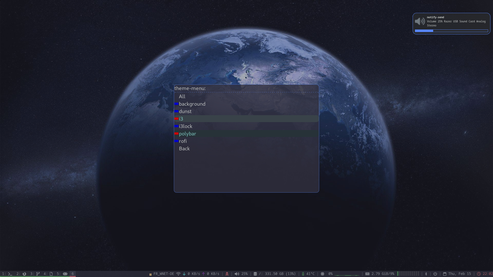
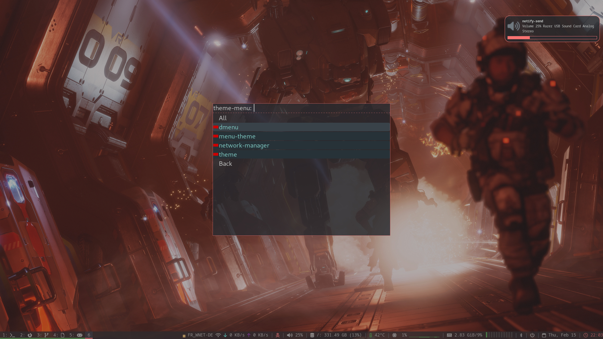

# Rofi-Themer

## Interactive menus to pick themes/ dotfiles

Rofi-Themer makes it easy to achieve even higher ricing levels by enabling you to pick different parts of themes using interactive menus.

At its core, it is just a [rofi script](https://davatorium.github.io/rofi/1.7.5/rofi-script.5/), but was not done in shell due to its complexity.

| | |
| ---------------------- | ---------------------- |
|  |  |
|  |  |


*******
- [Overview](#Overview)
- [Compiling](#Compiling)
- [Running](#Running)
- [Data format](#Data_format)
- [Example usage](#Example_usage)
*******

<div id="Overview"/>

## Overview

This project has a daemon, a program to query the daemon for information, and another to query it for menu data so that rofi can display it.

The daemon reads config data, parses it, and listens in on a unix socket.

The menu program can then be used to select themes using rofi. You can then use the read program to query the daemon and have it return strings, in my case paths to the configurations for the selected theme.

*******

<div id="Compiling"/>

## Compiling

Don't forget to clone recursively!!!

```bash
git clone --recurse-submodules git@github.com:IVSOP/Rofi-Themer.git
```

The script `build.sh` will configure CMake and build the code.

Three binaries are created in build/: Rofi-Themer-menu, Rofi-Themer-daemon and Rofi-Themer-read, however you do not need to run them directly.

To specify a location for the socket, pass the full path as an argument: `./build.sh <full path to socket, including its name>`

*******

<div id="Running"/>

## Running

Daemon - parses data and listens on the socket: `./Scripts/daemon.sh <dataset path>`. Running the daemon will create the socket, if it does not exist.

Menu - creates the menus themselves (feel free to edit it, it has my custom rofi command): `./Scripts/menu.sh`

Read - queries daemon for stored data: `./Scripts/read.sh <string>`. The string can be, for example:
- `dunst`: reads the value for the dunst option
- `rofi/theme`: goes into the subtable rofi and reads the value for the theme option
- `polybar/*`: goes into the subtable polybar and reads all values for all options, **in order** (even though json is unordered)

Multiple options are always separated by newline.

Please see [Data format](#Data_format) to better understand what will be returned depending on the data types.

> :warning: Unfortunately rofi messes up passing arguments to the scripts, so some things had to be hardcoded, such as the path to the binaries inside the menu and read scripts, and the location of the socket, defined in every main.cpp. However, you can choose a new location for the socket by passing it to build.sh as an argument, like stated in [Compiling](#Compiling)
> There is also currently no way to properly install this, so you can also have lots of fun editing the paths in the Scripts/ as you see fit.

*******

<div id="Data_format"/>

## Data format

The data files are stored as json. The first table is called `main.json`. If you are lazy, just use the provided data and see how it works.

The tables have this format:

```js
{
	"theme": "blue"

	"type": "table",

	"data": {

		"<name of option>": { // things here can be very different depending on data type, keep reading
			"type": "<type>",
			"theme": "<theme name>",
			"selected": 2
			"options": [
				["blabla", "blabla"],
				[],
				...
			]
		},

		..........
	}
}
```

The theme is a string with the name of the theme currently selected by this table.

The type indicates the data type, in this case a table. All data types are explained below.

Data contains a bunch of options, which can be seen as entries in the table. Each entry has a type, selected theme,
selected option, selected sub-option, and the options themselves, which represents the strings to show in the menu, and/or to make available when queried.

These options work like this:
```js
"options": [
	["theme 0 option 0", "theme 0 option 1"],
	[], // can be empty if theme should have no options
	["theme 2 option 0", "theme 2 option 1"]
]
```

As you can see, themes have indices. These are assigned to the themes via the color icons, which are only present in the main table:
```json
"color-icons": {
	"red": "red1.png",
	"blue": "blue1.png",
	"white": "white1.png",
	"purple": "purple1.png"
}
```

In this exampple, the "red" theme is the index 0, and the image to be used by it is "red1.png". You should probably use full paths for the images.

## Data types

### apply:

Means selecting this option immediately applies the theme to it. It is the simplest type. If you click it in the menu, its theme changes straight away.

Example:

```json
"dunst": {
	"type": "apply",
	"theme": "blue",
	"options": [
		".config/i3/themes/dunst/0/dunstrc-0", // option for first theme
		".config/i3/themes/dunst/1/dunstrc-1", // option for second theme
		".config/i3/themes/dunst/2/dunstrc-2", // ...
		".config/i3/themes/dunst/3/dunstrc-3"
	]
}
```

In this example, if you were to click "dunst" while in the second theme, the theme is instantly applied and querying this option would return ".config/i3/themes/dunst/1/dunstrc-1".

### apply_list:

The same as above, except the options have many values instead of one, only the query response changes.

```json
"network-manager": {
	"type": "apply_list",
	"theme": "blue",
	"options": [
		[".config/i3/themes/rofi/0/rofi-network-manager-0.conf", ".config/i3/themes/rofi/0/rofi-network-manager-0.rasi"],
		[".config/i3/themes/rofi/1/rofi-network-manager-1.conf", ".config/i3/themes/rofi/1/rofi-network-manager-1.rasi"],
		[],
		[".config/i3/themes/rofi/3/rofi-network-manager-3.conf", ".config/i3/themes/rofi/3/rofi-network-manager-3.rasi"]
	]
}
```

For example, instead of the query returning `something` like in apply, it would instead return
```
something1\n
something2\n
something3\n
...
```

### table:

Recurse into a new menu, from other table. The table is in a new file, called `<name>.json`.

These subtables are exactly the same as the main one, except without color icons.

On the table that 'includes' this one, you should write:

```json
"rofi": {
	"type": "table"
},
```

Which tells it to get the values from another file automatically.

Queries here don't make sense.

### list:

Show the menu of a list. This differs from tables, as only 1 option is allowed to be selected.

See the example below.

### list_picture:

Exactly the same as above, but the entries are displayed as the icons, instead of showing the theme icon.

I made this to allow, for example, previewing background images when selecting them.

Example:
```json
"background": {
	"type": "list_picture",
	"theme": "blue",
	"selected": 0, // current active option will be options[theme_index][selected]
	"options": [
		["BG/TF22.jpg","BG/TF21.jpg"],
		["BG/KSP1.jpg","BG/KSP2.png","BG/KSP3.png"],
		[],
		["BG/BladeR3.jpg"]
	]
}
```

For example, let's say you are in the theme 1 menu. This means that when you click this option, a new menu will be shown, with the options \["BG/KSP1.jpg","BG/KSP2.png","BG/KSP3.png"\]. You can then select one of these options.

When querying, only the selected option will be returned, like "BG/KSP1.jpg".

*******

<div id="Example_usage">

## Example usage

The way I use this is just to store symlinks that point to the config files of a certain theme.

I use i3, so in the config file(s), I have to first execute the daemon, passing in the path do the data folder:

```bash
#                        the script to lauch daemon                  data folder ending in /
exec --no-startup-id $HOME/Desktop/Rofi-Themer/Scripts/daemon.sh $HOME/Desktop/Rofi-Themer/data/
```

I also bind Win+Menu to open up the menu:

```bash
bindsym $mod+Menu exec --no-startup-id $HOME/Desktop/Rofi-Themer/Scripts/menu.sh
```

Lastly, when i3 powers up, I have many scripts getting the values and setting the symlinks.

For example, dunst:
```bash
#!/bin/bash

cd $HOME/.config/dunst

# get path from themer
DUNSTRC_PATH=$($HOME/Desktop/Rofi-Themer/Scripts/read.sh "dunst")

# check error
if [[ -z  $DUNSTRC_PATH ]]
then
	echo "Error"
else
	# set link
    ln -sfT $HOME/$DUNSTRC_PATH dunstrc # &>> /tmp/dunst_theme_script.txt
fi
```

This script reads the value of "dunst", then sets a symlink to it (first placing $HOME at the start)

You might have noticed I check if the value is empty. This is because there can be unexpected errors or, since this is being run right at the start, the daemon might not even be started and listening on the socket yet. You can probably solve that last problem in many different ways, but for now I just do nothing.

A more complex example, involving reading many values, is rofi itself:
```bash
#!/bin/bash

cd $HOME/.config/rofi/current-theme

mapfile -t ROFI_PATHS < <($HOME/Desktop/Rofi-Themer/Scripts/read.sh "rofi/*")

LINK_NAMES=( "dmenu-theme.rasi" "menu-theme.rasi" "network-manager.conf" "network-manager.rasi" "theme.rasi" )

if [ ${#ROFI_PATHS[@]} -eq ${#LINK_NAMES[@]} ] # check if correct number of data was received
then
	for (( i=0; i<${#ROFI_PATHS[@]}; i++ ))
	do
	   if ! [[ -z ${ROFI_PATHS[$i]} ]]
	   then
	       ln -sfT $HOME/${ROFI_PATHS[$i]} ${LINK_NAMES[$i]} # &>> /tmp/rofi_theme_script.txt
	   fi
	done
fi
```

This basically just uses mapfile to get all the values and place them in an array. The length is checked to detect errors, like in the first script.

You can execute these scripts automatically when i3 starts up, for example:
```bash
exec_always --no-startup-id $HOME/.config/rofi/current-theme/get-theme.sh
```

*******

This project is a C++ rewrite of [I-Themer](https://github.com/IVSOP/I-Themer), due to it being too much of a mess, and also has some more features.

After making this I found out about gnu stow, which does something very similar. In the future I might try to use it with this.
